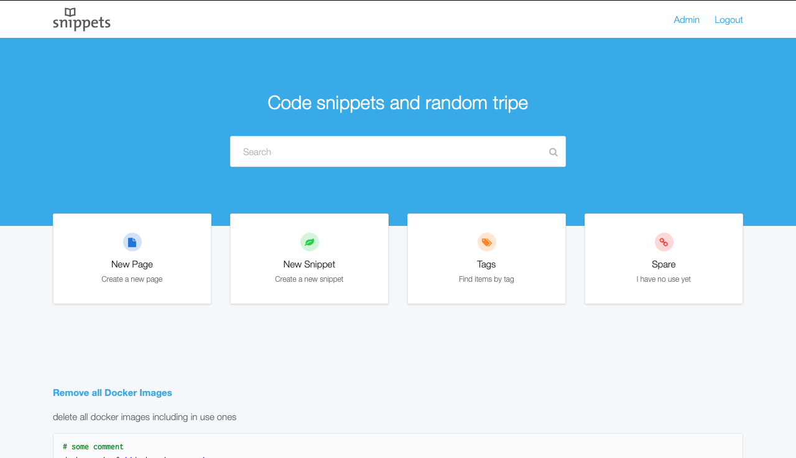
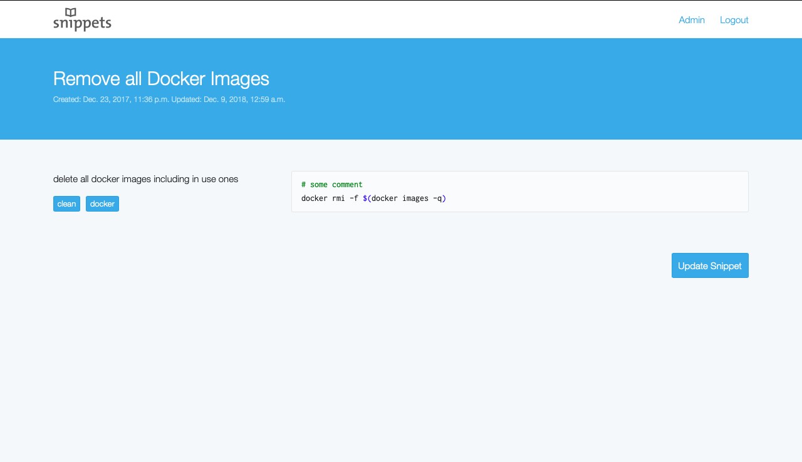
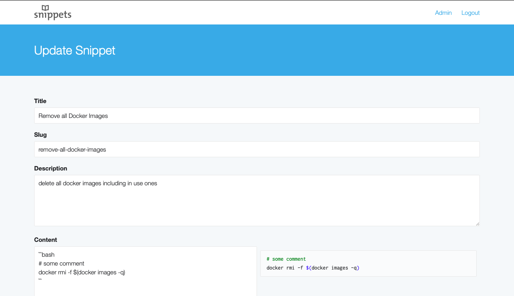

# Snippets

Website for storing code snippets.

### Screenshot





## Getting Started

```bash
docker compose up --watch
```

## Python Packages

See the [docs](https://docs.astral.sh/uv/) for more information.

install:
```bash
./run.sh uv add <package==1.0.0>
```

remove:
```bash
./run.sh uv remove <package>
```

## Auto Code Linting

```bash
./run.sh uv run black .
```

```bash
./run.sh uv run ruff check --fix .
```

### Django Stuff

migrate:
```bash
./run.sh uv run manage.py migrate
```

create yourself a superuser:
    
```bash
./run.sh uv run manage.py createsuperuser --email=admin@example.com --first_name=Admin --last_name=User
```
